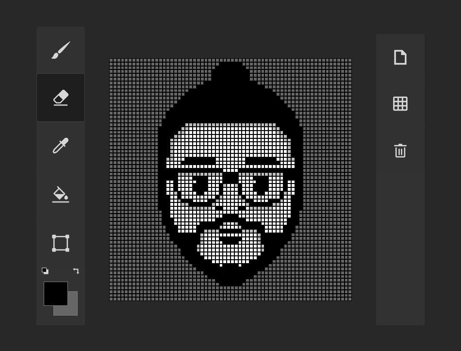

# ETCH-A-SKETCH

This project is part a The Odin Project's curriculum. Original project was to make a grid and change color of the squares by hovering, using only js and css grid. I tried to make something more challenging, better and more efficent version of this can be made with jquery and html canvas but I stick to the vanilla js and css grid since that was the main goal of this project. Eventhough it was a fun experience, it was a rabbit hole so I stopped improving it and continued with curriculum
 
<a href="https://zamkamec.github.io/ETCH-A-SKETCH/">Live Preview</a>
